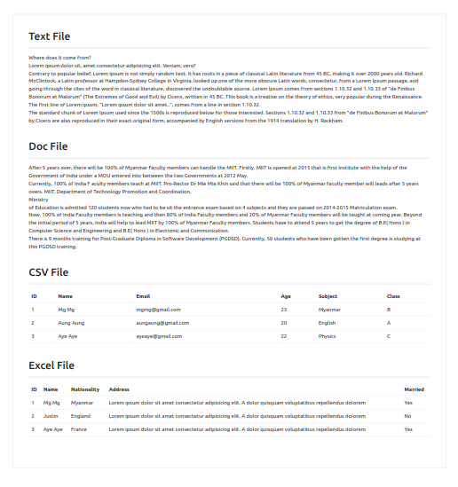

# Tutorial 05

## Read Excel, CSV, Doc And Text files.

## Folder Structure

```
.
├── ccs/
│   ├── reset.css
│   └── style.css
├── demo/
│   └── Tuto_05.png
├── files/
│   └── sample.csv
│   └── sample.doc
│   └── sample.txt
│   └── sample.xlsx
├── libs
├── index.php
└── README.md
```

## Installing PHPWord and PHPSpreadsheet with Composer

Run the following comment to initialize a new composer.json file in your project's root directory:

```bash
  composer init
```

To install PHPWord and PHPSpreadsheet libraries, run the following command in your terminal:

```bash
  composer require phpoffice/phpword phpoffice/phpspreadsheet
```

You can now start using phpword and phpspreadsheet in your PHP project by including the autoloader in your PHP file:

```php
  require 'vendor/autoload.php';
```

## Sample Web Page


