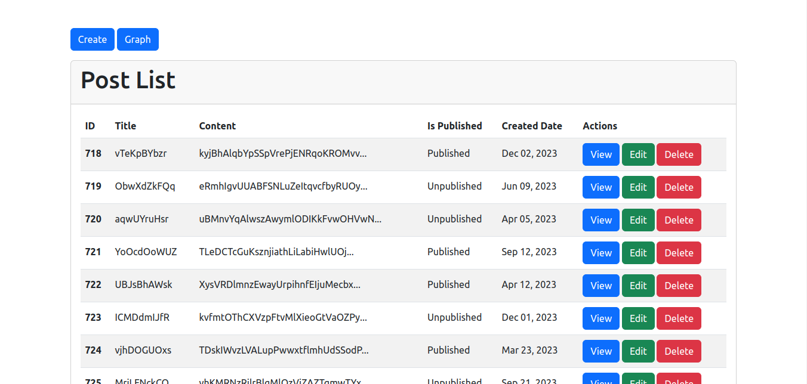
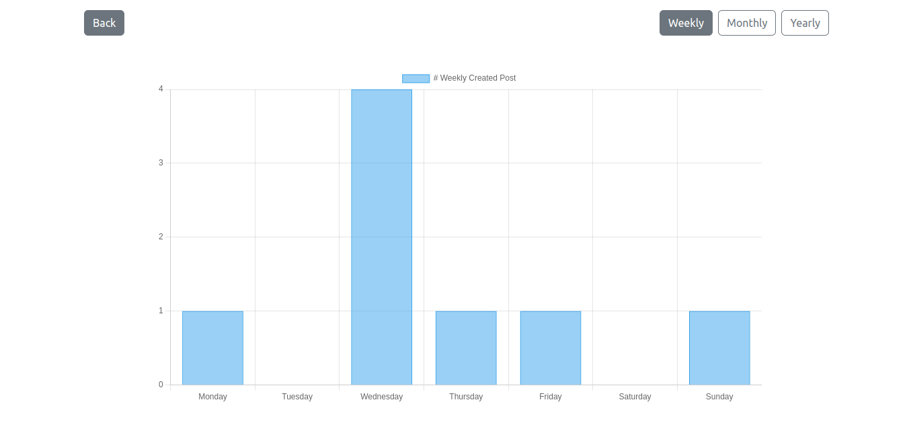
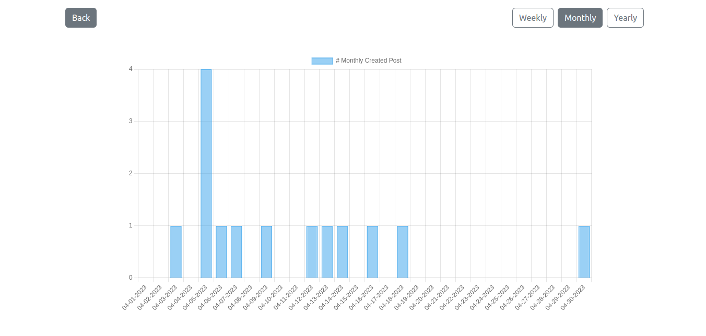
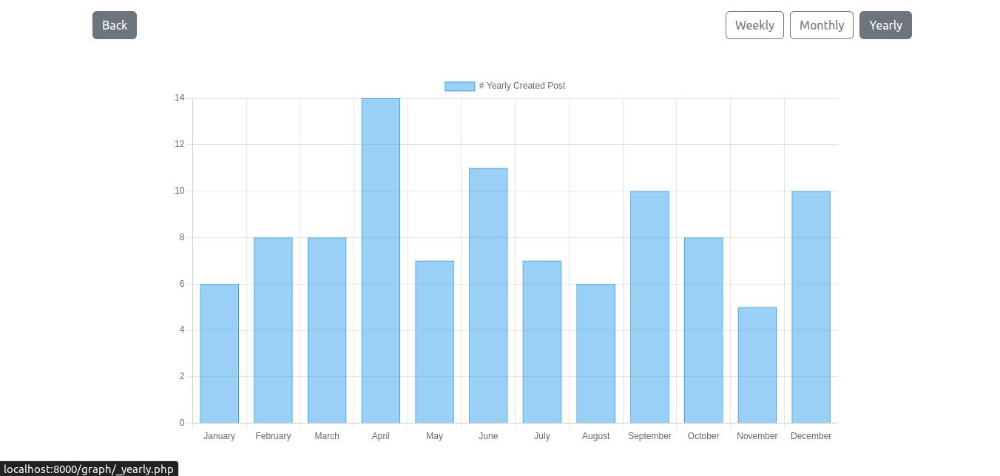

# Tutorial 09

## Show post data with weekly, monthly, yearly graph.

## Folder Structure
```
.
css/
├── reset.css
└── style.css
demo/
├── index.png
├── monthly.png
├── weekly.png
├── yearly.png
graph/
├── _monthly.php
├── _weekly.php
└── _yearly.php
js/
└── script.js
libs/
_dummy.php
db.php
create.php
index.php
detail.php
edit.php
index.php
README.md
```

## Index Page Design
;

<hr>

## Weekly Graph Design


<hr>

## Montly Graph Design


<hr>

## Yearly Graph Design

